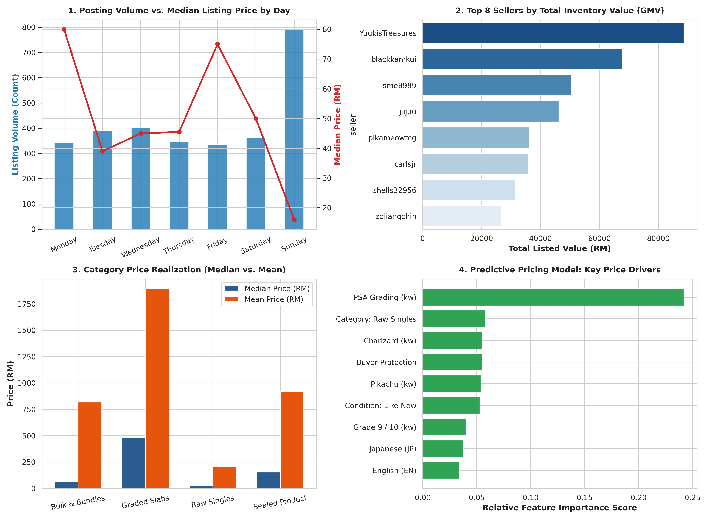
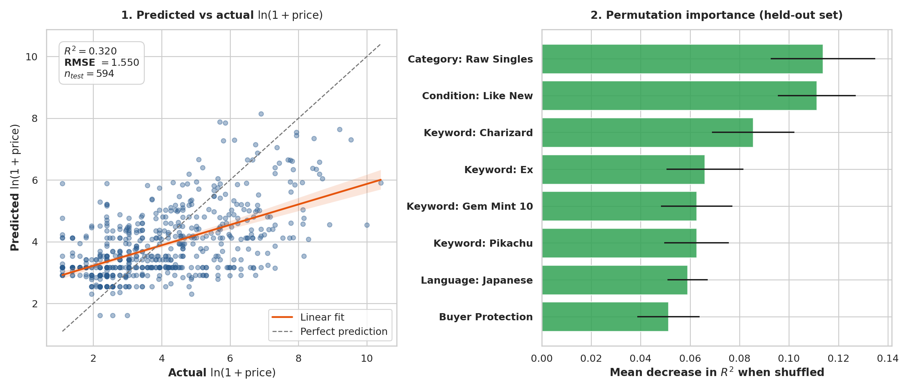

# 📊 Carousell Pokémon TCG Market Analysis

**[→ View the interactive dashboard](https://k0nghong96.github.io/carousell-pokemon-market-analysis/pokemon_market_report.html)**
**[→ Price lookup tool](https://k0nghong96.github.io/carousell-pokemon-market-analysis/pokemon_price_lookup.html)**

An end-to-end pipeline that scrapes, cleans, and analyses the Pokémon TCG secondary market on Carousell Malaysia.

**Dataset:** 3,061 scraped, 2,978 with valid prices, **2,968 after de-duplication** — collected **28 July 2026**, covering listings posted **1–28 July 2026** — the full 27-day window Carousell exposes for this search.

> Findings describe a live marketplace on a specific date. Rerun the scraper for current figures.

---

## 📸 Visualizations

### Market dashboard


### Model validation


---

## 🔑 Key Findings

### 1. Sellers batch their listing work into Sundays

Sunday carries **19.6% of listings — 133 per day against 84–101 on every other day**, a 33% lift over the next busiest day.

| Day | Listings | Per day | Median |
|---|---|---|---|
| **Sunday** | 531 | **133** | RM50 |
| Wednesday | 402 | 101 | RM45 |
| Tuesday | 391 | 98 | RM39 |
| Saturday | 362 | 91 | RM50 |
| Thursday | 346 | 87 | RM46 |
| Monday | 342 | 86 | RM80 |
| Friday | 335 | 84 | RM75 |

The mechanism is bulk uploads. Counting single-seller batches of 20+ listings in one day:

| Day | Batches | Listings |
|---|---|---|
| Sunday | 5 | 393 |
| Wednesday | 4 | 89 |
| Saturday | 3 | 67 |
| Tuesday | 2 | 46 |

Sellers clear inventory on weekends. Individual listings arrive at a steady rate all week; batches don't.

**Outlier sensitivity is the caveat.** One seller uploaded 259 listings on Sunday 12 July. Including it, Sunday's share reads 26.6% and its median collapses to RM16 — making it look like a low-value dump day. It isn't: excluding that single upload, Sunday medians RM50, squarely mid-pack. The volume pattern survives; the price story does not.

Highest median prices land on **Monday (RM80)** and **Friday (RM75)** — the low-volume days.

### 2. Value is extremely concentrated

- **100 listings hold 57% of total listed value** (of 2,968)
- Top 10 sellers account for 30% of listings; 60% of sellers have exactly one listing
- Median listing: **RM40**. Mean: **RM417**. Use the median.

### 3. Grading is rare and almost entirely PSA

Only **150 listings (5.1%)** classify as graded slabs.

| Category | Count | Median | Mean |
|---|---|---|---|
| Graded Slabs | 150 | RM550 | RM2,150 |
| Sealed Product | 96 | RM300 | RM1,185 |
| Bulk & Bundles | 130 | RM100 | RM1,300 |
| Raw Singles | 2,592 | RM30 | RM240 |

**The premium is concentrated in a single grade point:**

| Grade | n | Median |
|---|---|---|
| PSA 10 | 41 | RM1,700 |
| PSA 9 | 27 | RM350 |
| PSA 8 | 7 | RM180 |
| Raw | 2,805 | RM30 |

PSA 10 → PSA 9 is a **4.9× drop**. Below 9, the slab adds little over raw.

### 4. The market runs on Japanese-language singles

"Japanese" appears in **758 titles (25%)** — more than any Pokémon name, rarity code, or product type. Sealed product is nearly absent: booster boxes (21), ETBs (17), sealed (22) together are under 2% of listings.

### 5. Prices don't decay with listing age

Plotting price against days-since-posted shows a flat band across the full 27 days. Sellers do not discount unsold inventory — stale listings sit at their original ask.

### 6. A keyword model explains about a third of price variance

Random Forest on `ln(1 + price)`, 36 features from title keywords, category, condition, language and buyer protection:

```
test R² = 0.320    RMSE = 1.550 (log units)
n_train = 2,374    n_test = 594
```

Top drivers by Gini importance:

| Feature | Importance |
|---|---|
| Category: Raw Singles | 0.244 |
| Keyword: Charizard | 0.063 |
| Buyer Protection | 0.058 |
| Keyword: Gem Mint 10 | 0.057 |
| Keyword: Pikachu | 0.055 |
| Condition: Like New | 0.054 |

**R² of 0.32 is a modest result and worth stating plainly.** Title text cannot capture card identity — a "Charizard" listing might be a RM5 common or a RM10,000 slab, and nothing in the title reliably separates them. Two-thirds of price variance lives in information the model never sees. Improving this needs card-level identifiers (set codes, print runs) matched against a reference price source, not more keywords.

**Character tax:** Charizard listings median **RM250** and Pikachu **RM117**, against **RM40** market-wide.

---

## ⚠️ Data Quality Notes

Documented so results can be interpreted honestly:

- **83 junk prices** filtered (placeholders like `RM123456`, `RM99999`, `RM0`) — sellers signalling "make an offer"
- **19 Disney Lorcana slabs** surfaced in the Pokémon search from one seller and were excluded from all graded statistics; they inflated the graded median from RM495 to RM620
- **Comparable matching is limited.** Only 31% of titles contain a set number, and of 817 distinct set numbers, 744 appear exactly once. This market is a long tail of unique cards — more data yields more *different* cards, not more copies of the same one
- **Timestamps are day-granular** for listings older than 24h, so weekday assignment carries roughly ±1 day of error

---

## 🛠️ Setup

```bash
git clone https://github.com/k0nghong96/carousell-pokemon-market-analysis.git
cd carousell-pokemon-market-analysis
pip install -r requirements.txt
playwright install chromium
```

### Run the scraper

```bash
python carousell_pokemon_scraper.py
```

Takes roughly 15–20 minutes and writes timestamped JSON + CSV to `carousell_data/`. Key options in the `ScrapeConfig` block at the bottom of the file:

| Option | Default | Purpose |
|---|---|---|
| `headless` | `True` | `False` to watch the browser |
| `max_clicks` | `200` | Pagination cap; exits early when results run out |
| `sort_recent` | `True` | Sort newest-first, verified against scraped dates |
| `autosave_every` | `10` | Checkpoint frequency |
| `deep_scrape` | `False` | `True` visits each listing page (slow, more fields) |

### Run the analysis

```bash
python analysis.py
```

---

## 📁 Repository Structure

```
├── carousell_pokemon_scraper.py   # Async Playwright scraper
├── analysis.py                    # Statistics + Random Forest model
├── pokemon_market_report.html     # Interactive dashboard
├── data/                          # Scraped datasets
├── images/                        # Chart exports
└── requirements.txt
```

---

## 🔬 Scraper Implementation Notes

Non-obvious problems solved, in case they're useful to anyone scraping a similar SPA:

- **Service workers must be blocked.** Carousell is a PWA; when a JS chunk fails it serves an offline fallback page instead of results. `service_workers="block"` in the browser context prevents this.
- **Never block stylesheets.** Blocking `image`/`font`/`media` is safe; blocking `stylesheet` breaks the app shell.
- **`networkidle` never fires** — the page polls continuously. Wait for a listing selector instead.
- **Seller and timestamp live outside the listing anchor.** The scraper walks up to 6 parent levels to find the card container holding the `/u/` profile link.
- **Sort order is not a URL parameter.** It lives in app state, so it must be set by clicking the control — and verified from the scraped dates rather than the URL.
- **Extraction must be incremental.** Re-scanning all cards after each "Show more" is O(n²); at 2,000 listings a single pass costs 2,000 browser round-trips to find 47 new items. The scraper tracks a processed-card index instead.

---

## ⚖️ Responsible Use

This scraper is for personal research and portfolio purposes.

- It reads publicly visible search-result pages at browser speed, one page at a time
- It does **not** call Carousell's internal `/ds/` API, which their `robots.txt` disallows
- No authentication is bypassed and no rate limits are circumvented

If you reuse this, keep the pacing conservative and respect Carousell's Terms of Service.

---

## 📄 License

MIT — see [LICENSE](LICENSE).
